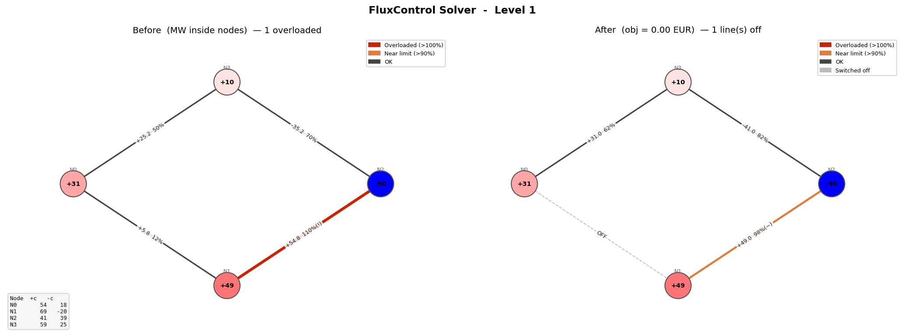

# FluxControl Solver

A little helper for the online game **[fluxcontrol.eu](https://fluxcontrol.eu)**.

In the game you are running a small electricity grid. Some power lines are
**overloaded** (carrying more than they can handle), and your job is to fix that
as **cheaply as possible** by turning each power station up or down, and by
connecting or disconnecting some power lines.

This tool does the hard maths for you and tells you the cheapest possible way to
remove the congestion. You copy a level out of the game, run one command, and it
tells you exactly how much to change each station, or which lines to connect or
disconnect.



---

## Requirements

1. **Python.** You can get it from [python.org](https://www.python.org/downloads/).
2. **Gurobi**, required to solve the optimization problem. Get the free licence at
   [gurobi.com](https://www.gurobi.com/) (it is free for students and academics).
3. **This tool.** Click the green **Code** button on the GitHub page, choose
   **Download ZIP**, and unzip it somewhere easy to find.

That is the setup. Now the fun part.

---

## How to use it

### Step 1: Set up the "Export" button (one time)

Follow **[Appendix A](#appendix-a-setting-up-the-export-button)** to create a
button that copies the current level to your clipboard (as JSON) whenever you
click it in the game. It takes a minute, and you only ever do it once.

### Step 2: Copy the level from the game

1. Open **fluxcontrol.eu** and start the level you want to solve.
2. Click your **Export** button.

The level is now on your clipboard. Nothing visible happens on the page, and
that is fine.

### Step 3: Solve it

Back in the terminal, run:

```
python grid_solver.py
```

With no file name, the tool reads the level straight from your clipboard and
solves it.

You can add an option too:

- `--no-switching` solves using only station up and down changes, without
  connecting or disconnecting any lines. Use this if you want a solution that
  keeps the grid wiring exactly as it is.

### Step 4: Read the answer

The tool prints something like this:

```
======================================================
  Optimal redispatch   (total cost = 137.25 EUR)
======================================================

Node adjustments:
  N0  -- no change   (+31.0 MW)
  N1  DN  -4.75 MW   +49.0 -> +44.2 MW
  N2  UP  +4.75 MW   -90.0 -> -85.2 MW
  N3  -- no change   (+10.0 MW)

Line flows after redispatch:
  L0-1     +1.00 MW  (  2.0% of 50 MW)  [ok]
  L1-2    +50.00 MW  (100.0% of 50 MW)  [near-limit]
  L2-3    -40.00 MW  ( 80.0% of 50 MW)  [ok]
```

Here is how to read it:

- **Total cost** is the price of the fix. This is the number you are keeping low.
- **Node adjustments** are your to-do list:
  - **UP** means turn that station up by the shown amount.
  - **DN** means turn it down.
  - **no change** means leave it alone.
- **Line flows** are the result. Every line should say `[ok]` or `[near-limit]`,
  and none should say `[OVERLOADED]`.

A picture of the grid (before versus after) also pops up in a separate window,
with overloaded lines shown in red so you can see the problem and the fix.

### Step 5: Enter the numbers in the game

Go back to FluxControl and set each station to the adjustment from the list
(UP to increase, DN to decrease). The numbers always add up to zero, so the grid
stays balanced, and that is what unlocks the game's **Confirm** button.

Done. The overload is cleared at the lowest possible cost.

---

An example level, `level1.json`, is included, so you can try the solver right
away without the game:

```
python grid_solver.py level1.json
```

---

## For the curious

Under the hood this solves a **DC optimal power flow** problem with on/off
constraints: it finds the cheapest change to power injections that keeps every
line within its limit, using the standard linear ("DC") approximation of how
power flows through a grid. For background, see Zhu's
*Optimization of Power System Operation* [[ref]][opf-ref].

[opf-ref]: https://link.springer.com/content/pdf/bbm:978-3-642-17989-1/1.pdf

---

## Appendix A: Setting up the Export button

The Export button is a *bookmarklet*: a browser bookmark that runs a tiny script
instead of opening a web page. This one reads whatever level the game currently
has loaded and copies it to your clipboard, so you can hand it to the solver.

To create it:

1. Open a terminal, go into the tool's folder, and run:

   ```
   python grid_solver.py --bookmarklet
   ```

2. It prints two long lines that start with `javascript:...`. Copy the one under
   **"COPY bookmarklet"** (this is the one that copies to the clipboard).
3. In your browser, right-click the bookmarks bar and choose **Add page**
   (or **New bookmark**).
4. **Name:** anything, for example `Export FluxControl`.
   **URL / Address:** paste the `javascript:...` line you copied. Then save.

You now have an **Export** button on your bookmarks bar. Click it on any loaded
level to copy that level to your clipboard, then continue from Step 2 above.

**Prefer a file instead of the clipboard?** The other printed line,
**"DOWNLOAD bookmarklet"**, saves the level as `levelX.json` in your Downloads
folder rather than copying it. In that case, pass the file to the solver:

```
python grid_solver.py "C:\Users\YourName\Downloads\levelX.json"
```
